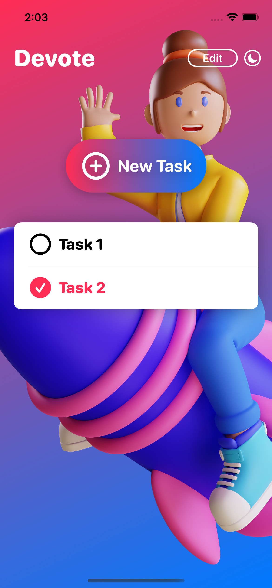
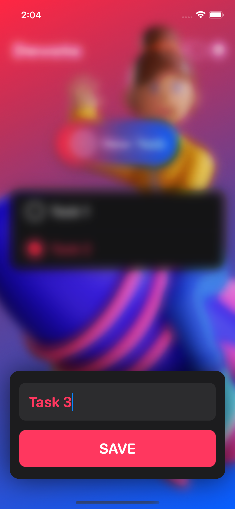
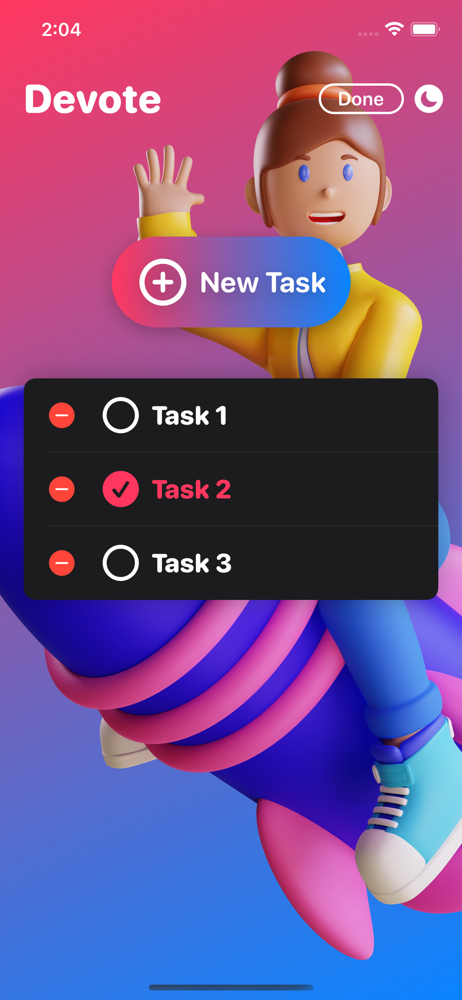
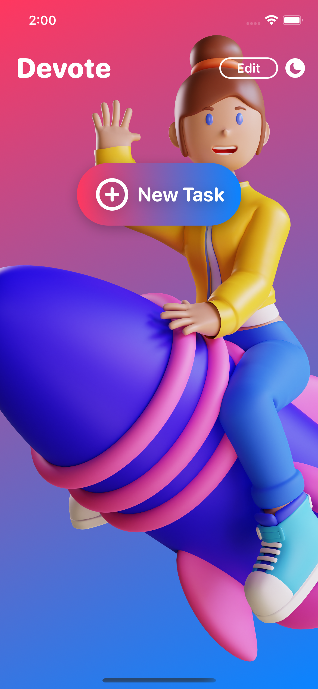
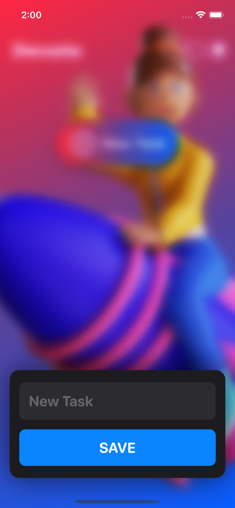

# Devote_SwiftUI

---

<h2> 
  Full featured Task Manager like app written in SwiftUI.
</h2>

  
  
  

  
  

---

<h2>
  Features
</h2>

- Add new Task.
- Edit/Delete task.
- Mark the completed task.
- Change themes.
- Widget functionality.

---

<h2>
  Notes
</h2>

 Task added or deleted will be notified with sound.

---

<h2>
  Watch Full Video
</h2>

<a href="https://drive.google.com/file/d/1pvwA_l1BYQpprerMo5mMJ_Khpxf4eqfd/view?usp=drivesdk"> Click here to Watch the full Functionality. </a>

---
